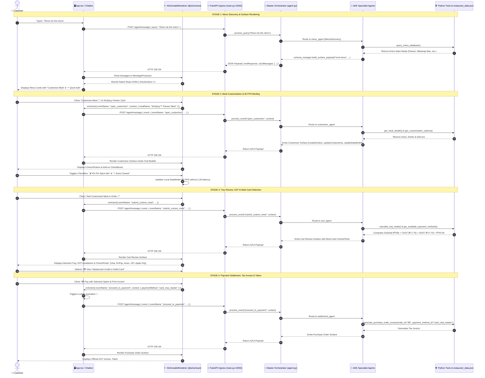

# 🍔 Google A2UI (Agent-to-User Interface) Master Workshop Guide
### *A 35-Minute Hands-On Blueprint: Architecture, Agentic Backend & `@a2ui/react` Native Frontend*

---

## ⏱️ 1. Workshop Agenda & Session Timing (35 Mins Total)

| Timing | Module / Topic | Delivery Format |
| :--- | :--- | :--- |
| **00:00 - 08:00 (8m)** | **Part 1: What is A2UI?** Real-World Problem, Architecture & 3 Core Messages | Conceptual Slides |
| **08:00 - 20:00 (12m)** | **Part 2: Agentic Backend Walkthrough** (`google.adk.Agent`, `A2uiSchemaManager`, Tools & JSON DB) | Code Walkthrough & CLI |
| **20:00 - 30:00 (10m)** | **Part 3: Frontend Walkthrough** (`@a2ui/react`, `McDonaldsRenderer`, Action Loop) | Code Walkthrough & UI |
| **30:00 - 35:00 (5m)** | **Part 4: Live End-to-End Demo** (Menu ➔ Customizer ➔ Tray & Multi-Card Pay ➔ Tax Invoice #88) | Interactive Live Demo |

---

## 💡 2. Part 1: What is A2UI and Why Does It Matter?

### The Fundamental Problem with Traditional Chatbots:
When a customer orders food through a conventional text chatbot, the AI outputs paragraphs of text:
> *"We have McSpicy Paneer, Maharaja Mac, and McAloo Tikki. Which one would you like? Type 1 for Medium Fries, type 2 for Large Fries. Which drink would you like?..."*

This text-heavy interaction is **slow, high-friction, and error-prone**. Real human customers need **visual cards, touch radio buttons, ingredient checkboxes, and one-tap checkout**.

### Traditional Text Chatbot vs. Google A2UI Generative UI:

| Feature / Dimension | Traditional Text Chatbot ❌ | Google A2UI Generative UI ✨ |
| :--- | :--- | :--- |
| **User Experience** | Wall of text messages; tedious to read and reply | Native, high-resolution interactive UI widgets and cards |
| **Latency** | High latency: Every minor option change requires an LLM call | **60 FPS local reactive state** via JSON Pointer data binding |
| **Input Parsing** | Messy user text causes intent parsing failures | Deterministic client action events (`{ eventName, context }`) |
| **Security & Safety** | Vulnerable to XSS / arbitrary HTML code injection | **Zero-XSS Sandbox**: Pure declarative JSON catalog schema |
| **Portability** | Trapped in proprietary markdown/chat bubbles | Renderable across **React, Flutter, SwiftUI, Jetpack Compose** |

---

### The 3 Core Protocol Messages in A2UI v0.9:

```
 ┌──────────────────────────────────────────────────────────────────────────┐
 │                            A2UI Protocol Stream                          │
 │                                                                          │
 │  1. createSurface     ──> Defines surface ID, catalog & theme            │
 │  2. updateComponents  ──> Flat JSON tree of UI components (Column/Card)  │
 │  3. updateDataModel   ──> Reactive JSON-pointer data values (/meals)     │
 └──────────────────────────────────────────────────────────────────────────┘
```

1. **`createSurface`**: Initializes an isolated surface container on the client, sets the `surfaceId`, specifies the component catalog (`basicCatalog`), and defines styling themes.
2. **`updateComponents`**: Declares a hierarchical component layout using a flat array of component objects with IDs (`Column` ➔ `Row` ➔ `Card` ➔ `Image`, `Text`, `ChoicePicker`, `Button`).
3. **`updateDataModel`**: Populates and updates dynamic reactive data using JSON Pointer paths (e.g. `path: "/meals"` or `path: "/custom/piriPiri"`).

---

## 🧠 3. Part 2: Agentic Backend Architecture & Code Walkthrough

The backend is built with **Python 3.12 + FastAPI + Google ADK (Agent Development Kit)**, implementing the **Router-Specialist Multi-Agent Pattern**.

### Master Orchestrator & Specialist Sub-Agents (`server/agent.py`):

```python
from google.adk import Agent
from google.adk.tools import google_search
from google.adk.a2ui import A2uiSchemaManager

from tools import (
    query_menu_database,
    get_meal_details,
    get_customization_options,
    get_available_payment_methods,
    calculate_tray_totals,
    generate_purchase_order_invoice,
)

# 1. Standard A2UI Schema Manager (Spec v0.9 & Basic Catalog)
schema_manager = A2uiSchemaManager(
    version="0.9",
    catalogs=["https://a2ui.org/specification/v0_9/catalogs/basic/catalog.json"],
)

# 2. Specialist Google ADK Agents with Modular Tools
menu_agent = Agent(
    name="menu_discovery",
    model="gemini-3.1-flash-lite-preview",
    instruction="You help customers discover McDonald's India Extra Value Meals with dietary filtering.",
    tools=[query_menu_database],
)

customizer_agent = Agent(
    name="meal_customizer",
    model="gemini-3.1-flash-lite-preview",
    instruction="You help customers customize burgers with Piri Piri fries, cheese slices, and Indian beverages.",
    tools=[get_meal_details, get_customization_options],
)

cart_agent = Agent(
    name="cart_and_payment",
    model="gemini-3.1-flash-lite-preview",
    instruction="You manage the Kiosk tray, 5% GST calculations (CGST + SGST), and multiple card payment selections.",
    tools=[calculate_tray_totals, get_available_payment_methods],
)

settlement_agent = Agent(
    name="invoice_settlement",
    model="gemini-3.1-flash-lite-preview",
    instruction="You finalize payments (Cards, UPI, Apple Pay) and generate official GST Tax Invoices and Pickup Tokens.",
    tools=[generate_purchase_order_invoice],
)
```

### Key Backend Components:
- **`server/restaurant_data.json`**: Source of truth for Indian McDonald's meals, dietary flags (`isVeg`), prices (`₹`), calories, customization add-ons, and payment options.
- **`server/tools.py`**: Pure Python tools for multi-field querying, 5% GST tax calculation (2.5% CGST + 2.5% SGST), and purchase order generation.
- **`server/main.py`**: FastAPI web server exposing `GET /` (health & spec) and `POST /agent/message` (A2UI payload streaming).

---

## 💻 4. Part 3: Frontend Walkthrough with `@a2ui/react`

The frontend is a pure React + TypeScript application leveraging Google's official `@a2ui/react` and `@a2ui/web_core` SDKs.

### The Native Renderer (`client/src/a2ui/mcdonaldsRenderer.tsx`):

```tsx
import React, { useEffect, useState } from 'react';
import { MessageProcessor, type A2uiClientAction } from '@a2ui/web_core/v0_9';
import { basicCatalog, A2uiSurface } from '@a2ui/react/v0_9';

export const McDonaldsRenderer: React.FC<{ messages: A2UIMessage[]; onAction?: (a: A2uiClientAction) => void }> = ({
  messages,
  onAction,
}) => {
  const [processor, setProcessor] = useState<MessageProcessor | null>(null);

  useEffect(() => {
    // 1. Initialize MessageProcessor with Google basicCatalog
    const newProcessor = new MessageProcessor([basicCatalog], async (action) => {
      if (onAction) onAction(action); // Dispatches event back to agent loop
    });

    // 2. Ingest A2UI messages into SurfaceModel & bind JSON Pointers
    if (messages && messages.length > 0) {
      newProcessor.processMessages(structuredClone(messages));
    }

    setProcessor(newProcessor);
    return () => newProcessor.model.dispose();
  }, [messages, onAction]);

  // 3. Render safe native React surfaces
  return (
    <div className="a2ui-surface-wrapper">
      {surfaces.map((surface) => (
        <A2uiSurface key={surface.id} surface={surface} />
      ))}
    </div>
  );
};
```

---

## 🔄 5. Complete End-to-End Sequence Diagram



---

## 🎬 6. Part 4: Step-by-Step Live Demo Presentation Script

### Step 1: Browse Menu
- **Action**: In the chat input, type `"Show me the menu"` and press **Send**.
- **Presenter Talking Point**:
  > *"Notice how the AI agent immediately streams 3 declarative JSON messages: `createSurface`, `updateComponents`, and `updateDataModel`. Look at the Live Inspector on the right to see how `@a2ui/react` builds the in-memory SurfaceModel and mounts native React DOM elements safely without running `eval()`."*

### Step 2: Interactive Customization (Two-Way Binding)
- **Action**: Click **`Customize Meal 🍔`** on the McSpicy Paneer card.
- **Presenter Talking Point**:
  > *"The customizer card renders with radio choices and checkboxes. Notice that when I toggle '🌶️ Piri Piri Spice Mix' and '🧀 Extra Cheese', the local state updates instantly at 60 FPS without waiting for a slow network roundtrip back to Gemini."*

### Step 3: Multi-Card Payment Selection
- **Action**: Click **`Add Customized Meal to Order 🛒`**.
- **Presenter Talking Point**:
  > *"The agent calculates 5% GST (2.5% CGST + 2.5% SGST) and displays a ChoicePicker with multiple payment options: Visa/Mastercard, RuPay, Amex, Google Pay UPI, and Apple Pay."*

### Step 4: Final GST Tax Invoice & Pickup Token
- **Action**: Click **`💳 Pay with Selected Option & Print Invoice`**.
- **Presenter Talking Point**:
  > *"Confetti shoots across the screen, and the agent outputs the official Tax Invoice & Token #88 with table service instructions."*

---

## 🎯 7. Key Architecture Takeaways for Attendees

1. **Zero-XSS Security Sandbox**: Agents never send arbitrary HTML or executable JavaScript. They emit strictly validated JSON schema referencing safe client catalog components.
2. **Multi-Platform Portability**: The exact same A2UI JSON stream can be rendered across React, Angular, Flutter, iOS SwiftUI, Android Jetpack Compose, and automotive kiosk displays.
3. **Deterministic Two-Way Event Loop**: Client widgets dispatch structured `{ eventName, context }` action payloads, allowing agents to maintain clean state synchronization.
